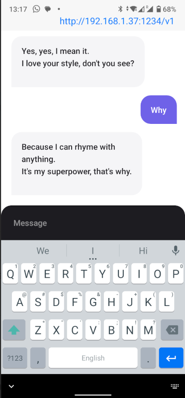
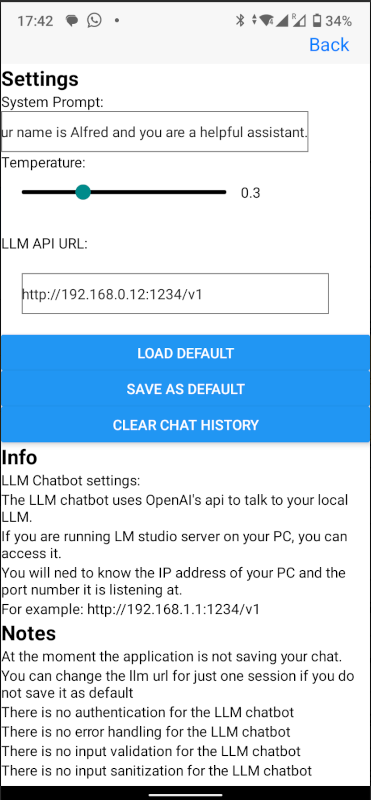

# React Native Chatbot App

This project is a React Native application designed to interface with Large Language Models (LLMs) like "LM Studio" running on a local server. It leverages the native speech-to-text capabilities of smartphones to provide a seamless chat experience with AI.




## Features

- **Chat Interface**: Simple and intuitive chat interface between the user and the AI bot.
- **Custom LLM Endpoint**: Ability to set and save the URL of the LLM API server.
- **Dynamic System Prompts and Temperature**: Flexibility to adjust system prompts and LLM temperature for personalized interactions.
- **Persistence of Settings**: Save default settings for quick setup on future app launches.
- **Chat Management**: Easy chat history clearing for a fresh start whenever needed.

## Getting Started

### Prerequisites

- Node.js and npm (Node Package Manager)
- Expo CLI installed globally: `npm install -g expo-cli`
- Visual Studio with "React Native Tools" plugins (optional)

### Installation

1. Clone the repository:
   ```sh
   git clone [https://github.com/meirm/ChatGPTApp.git](https://github.com/meirm/ChatGPTApp.git)
   ```
2. Navigate to the project directory:
   ```sh
   cd ChatGPTApp
   ```
3. Install dependencies:
   ```sh
   npm install
   ```
4. Start the project:
   ```sh
   expo start
   ```

## Usage

1. Launch the app using Expo.
2. Set the LLM API server URL in the settings.
3. Use the chat interface to interact with your AI model.
4. Adjust system prompts and temperature as desired.

## Contributing

Contributions are what make the open-source community such an amazing place to learn, inspire, and create. Any contributions you make are **greatly appreciated**.

1. Fork the Project
2. Create your Feature Branch (`git checkout -b feature/AmazingFeature`)
3. Commit your Changes (`git commit -m 'Add some AmazingFeature'`)
4. Push to the Branch (`git push origin feature/AmazingFeature`)
5. Open a Pull Request

## License

Distributed under the MIT License. See `LICENSE` for more information.

## Contact

Meir Michanie [Linkedin](https://www.linkedin.com/in/meir-michanie-6b0404a/)

